# 🔖 PROJECT 8OOK-MARK “책갈피”

### 다양한 독서 생각들을 쌓아 마음의 양식으로 만드는 공간.

멋쟁이사자처럼 프론트엔드 부트캠프 14기

**8조 - TEAM 8OOKMARK**

[](https://8ookmark.netlify.app/)
_이미지를 클릭하면 배포 링크로 이동합니다._

## 📑 목차

1. [프로젝트 개요](#-프로젝트-개요)
2. [책갈피 팀 소개](#-책갈피-팀-소개)
3. [프로젝트 설명](#-프로젝트-설명)
4. [디자인](#-디자인)
5. [참고 자료](#-참고-자료)

## 📜 프로젝트 개요

**책갈피 | 8OOKMARK** 는 독서 기록과 공유 서비스를 지원하는 **반응형** 웹사이트입니다.

Fast API와 supabase로 단일 서버를 구축해 유저 정보 및 커뮤니티를 관리하며,

Aladin Open API에서 도서 목록을 받아와 원하는 도서를 검색 후 평가할 수 있게 합니다.

### 프로젝트 기간

2025년 7월 18일 ~ 2025년 8월 4일 (총 19일)

### 개발 환경

| 분류                  | 사용 기술                                                                                                                                                                                                                                                                                                                                                                                                           |
| --------------------- | ------------------------------------------------------------------------------------------------------------------------------------------------------------------------------------------------------------------------------------------------------------------------------------------------------------------------------------------------------------------------------------------------------------------- |
| **프론트엔드**        |                                                                                                                              |
| **백엔드**            |                  |
| **빌드 도구**         |                                                                                                                                                                                                                                                                                                                               |
| **협업/디자인**       |                                     |
| **배포**              |                                                                                                                                                                                                                          |
| **패키지/라이브러리** |     |

## 👩‍💻 책갈피 팀 소개

안녕하세요, 팀 책갈피입니다!

저희 팀은 **깔끔한 UI**와 사용자 입장에서 **꼼꼼하게 설계한 UX**를 통해

실제 서비스를 고려한 프로젝트 제작을 지향했습니다.

| 문서영                                                                                                | 이지수                                                                                                    | 김상훈                                                                                                  | 이범원                                                                                                  |
| ----------------------------------------------------------------------------------------------------- | --------------------------------------------------------------------------------------------------------- | ------------------------------------------------------------------------------------------------------- | ------------------------------------------------------------------------------------------------------- |
| FE/스크럼 마스터                                                                                      | FE/디자인                                                                                                 | FE/발표                                                                                                 | BE                                                                                                      |
| ---                                                                                                   | ---                                                                                                       | ---                                                                                                     | ---                                                                                                     |
| 폴더 관리, 공통 컴포넌트 제작 및 대시보드/글쓰기 페이지 구현                                          | 디자인 시안 제작 및 커뮤니티 페이지 구현                                                                  | 공통 컴포넌트 제작 및 개인서랍 페이지 구현                                                              | 서버 구축, 알라딘 API 연동 및 로그인/회원가입 페이지 구현                                               |
| [](https://github.com/rhocci) | [](https://github.com/chacokyo) | [](https://github.com/ksh2998) | [](https://github.com/bemowon) |

## 🚀 프로젝트 설명

### 폴더 구조

재사용과 유지보수성을 최우선으로 고려, 각 컴포넌트들을 모듈화하여 관리했습니다.

    ```jsx
    src
    ├── 📁 api
    │   ├── communityData.js
    │   ├── dashboardData.js
    │   ├── loginAndSignupAuth.js
    │   ├── myShelfData.js
    │   └── writeData.js
    ├── 📁 assets
    │   ├── 📁 icon/
    │   ├── 📁 image/
    │   └── 📁 login/
    ├── 📁 common
    │   ├── base.css
    │   ├── reset.css
    │   ├── theme.css
    │   └── utilities.css
    ├── 📁 components
    │   ├── 🧩 BookBlock
    │   │   ├── BookBlock.css
    │   │   └── BookBlock.js
    │   ├── 🧩 BookCard
    │   │   ├── BookCard.css
    │   │   └── BookCard.js
    │   ├── 🧩 BookCover
    │   │   ├── BookCover.css
    │   │   └── BookCover.js
    │   ├── 🧩 BookHover
    │   │   ├── BookHover.css
    │   │   └── BookHover.js
    │   ├── 🧩 BookItem
    │   │   ├── BookItem.css
    │   │   └── BookItem.js
    │   ├── 🧩 BookStack
    │   │   ├── BookStack.css
    │   │   └── BookStack.js
    │   ├── 🧩 Button
    │   │   ├── Button.css
    │   │   └── Button.js
    │   ├── 🧩 Carousel
    │   │   ├── Carousel.css
    │   │   └── Carousel.js
    │   ├── 🧩 Header
    │   │   ├── Header.css
    │   │   └── Header.js
    │   ├── 🧩 Input
    │   │   ├── Input.css
    │   │   └── Input.js
    │   ├── 🧩 Modal
    │   │   ├── Modal.css
    │   │   └── Modal.js
    │   ├── 🧩 Profile
    │   │   ├── Profile.css
    │   │   └── Profile.js
    │   ├── 🧩 ScrollTopButton
    │   │   ├── ScrollTopButton.css
    │   │   └── ScrollTopButton.js
    │   ├── 🧩 Sidebar
    │   │   ├── Sidebar.css
    │   │   └── Sidebar.js
    │   └── 🧩 Title
    │       ├── Title.css
    │       └── Title.js
    ├── 📁 data
    │   └── carouselData.js
    ├── 📁 pages
    │   ├── 🖥️ Community
    │   │   ├── Community.css
    │   │   ├── Community.html
    │   │   └── Community.js
    │   ├── 🖥️ Dashboard
    │   │   ├── calendar-override.css
    │   │   ├── Dashboard.css
    │   │   ├── Dashboard.html
    │   │   └── Dashboard.js
    │   ├── 🖥️ LoginAndSignUp
    │   │   ├── LoginAndSignUp.css
    │   │   ├── LoginAndSignUp.html
    │   │   └── LoginAndSignUp.js
    │   ├── 🖥️ MyShelf
    │   │   ├── MyShelf.css
    │   │   ├── MyShelf.html
    │   │   └── MyShelf.js
    │   └── 🖥️ Write
    │       ├── Write.css
    │       ├── Write.html
    │       └── Write.js
    ├── 📁 utils
    │   ├── auth.js
    │   ├── date.js
    │   ├── modal.js
    │   ├── main.js
    │   └── style.css
    ├── index.html
    ├── .gitignore
    ├── .prettierrc
    ├── .prettierignore
    ├── eslint.config.js
    ├── vite.config.js
    ├── package.json
    ├── package-lock.json
    ├── pnpm-lock.yaml
    ├── pnpm-workspace.yaml
    └── README.md
    ```

컴포넌트 명세 바로가기 →

### 프로젝트 미리보기

1. **커뮤니티(비로그인 메인 페이지)**

   사이트 접속 시 가장 먼저 만나게 되는 페이지입니다.

   비로그인 상태에서도 접근할 수 있으며,

   사용자들이 공개로 저장한 독서 기록들이 자동으로 업로드됩니다.

   
   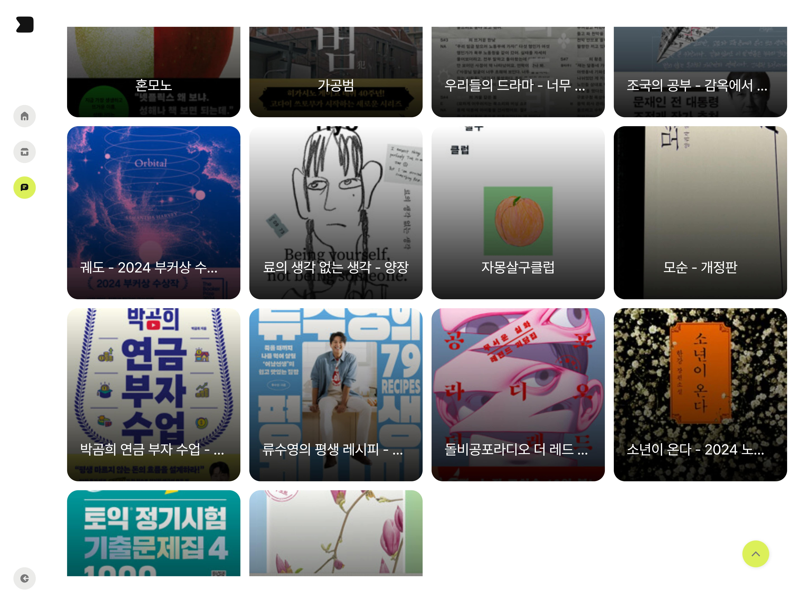

   **핵심 기능**
   - 자동 슬라이드 캐러셀 배너
   - 정렬 기능(최신순, 이름순)
   - public 독서기록을 서버에서 연동 후 렌더링
     **사용 컴포넌트**
   - Sidebar
   - Button
   - BookHover
   - Carousel
   - Title
   - ScrollTopButton

2. **대시보드(로그인 메인 페이지)**

   로그인 시 가장 메인이 되는 페이지입니다.

   최근 한 달 간 기록한 책의 제목과 한줄평이 블록 형태로 쌓여 한 눈에 읽은 책의 권수를 확인할 수 있도록 디자인했습니다.

   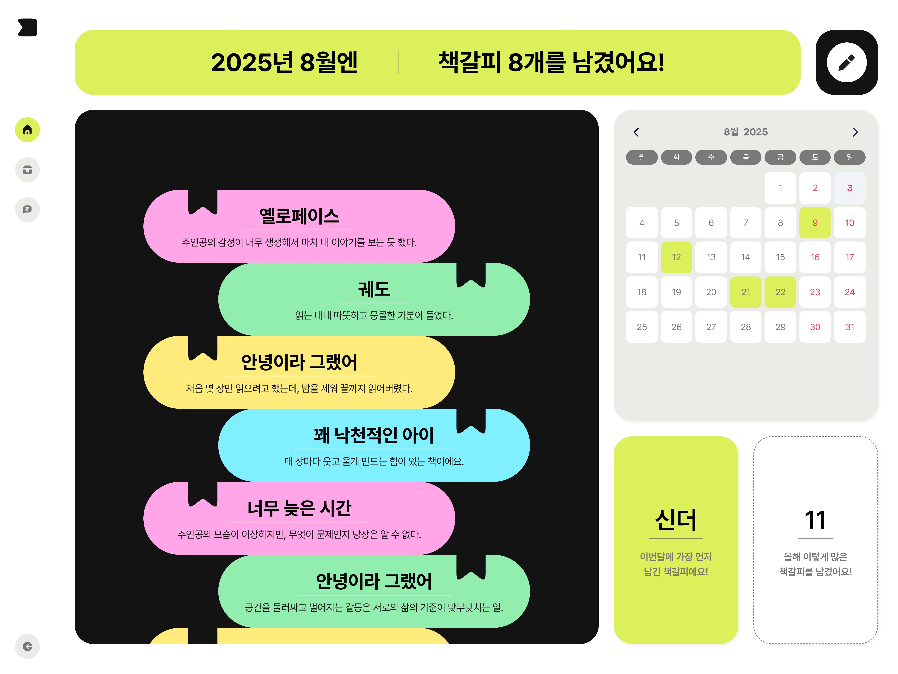
   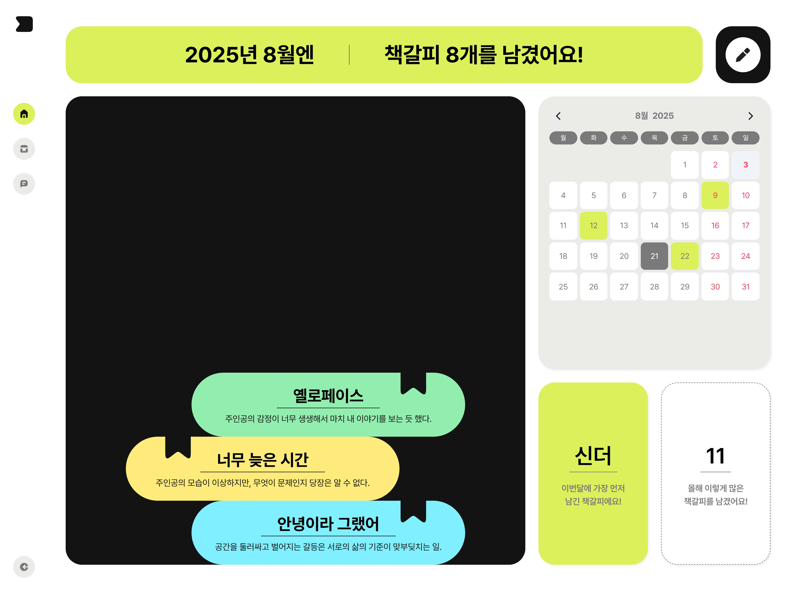

   **핵심 기능**
   - 이달에 기록한 책갈피 총 갯수, 이번 달 처음으로 남긴 기록의 책 제목, 올해 기록한 책갈피 총 갯수가 보여지는 개인 통계 기능
   - 기록이 있는 날엔 달력 하이라이트, 날짜 클릭 시 해당 날짜 기록들이 보이는 캘린더 기능
   - 독서기록 블록이 쌓이면 스크롤 가능하며, 클릭 시 해당 기록의 모달이 팝업됨
   - 독서기록 쓰기 페이지로 이동(좌상단 버튼)
     **사용 컴포넌트**
   - Sidebar
   - Title
   - BookStack(-BookBlock)
   - Modal(-Title, BookCover, Button)

3. **글쓰기 페이지**

   대시보드에서 접근 가능한 페이지입니다.

   베스트셀러 도서 목록 중 원하는 책을 선택한 후 감상 기록을 남길 수 있습니다.

   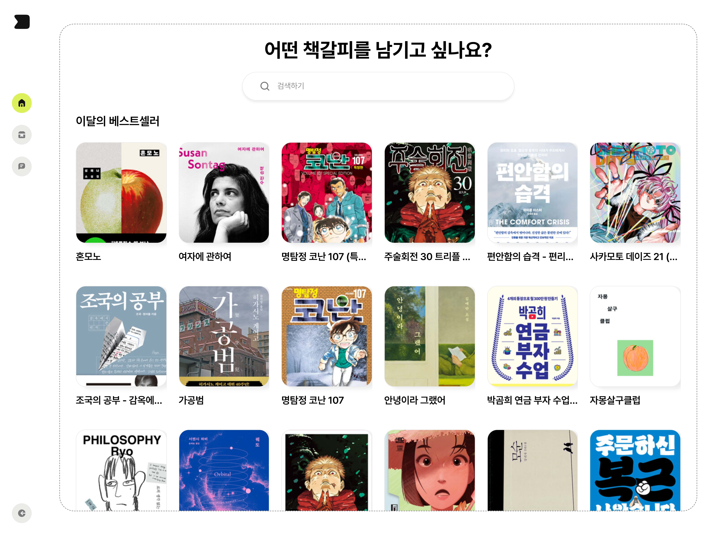
   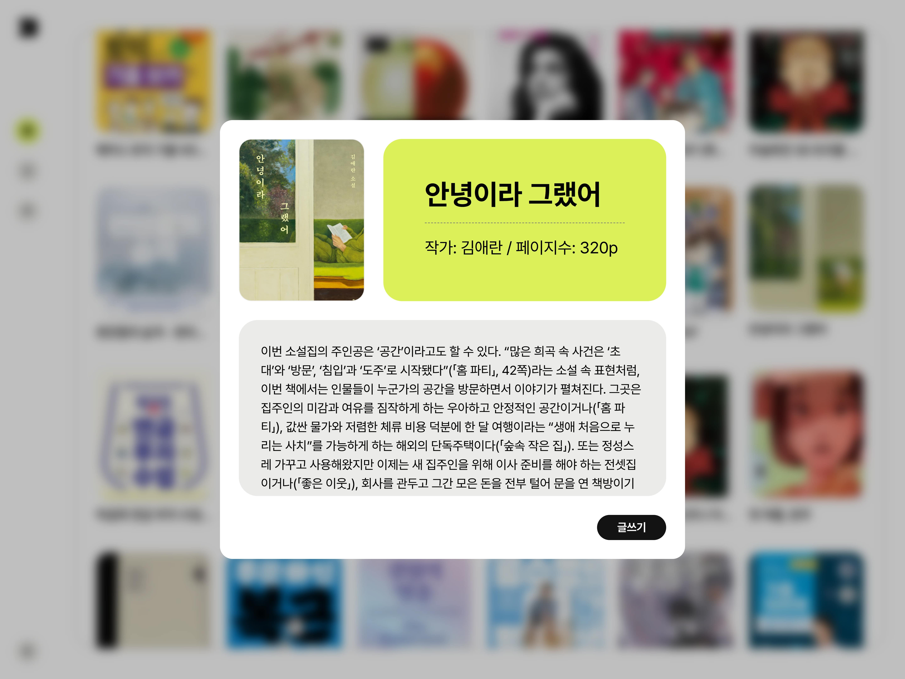
   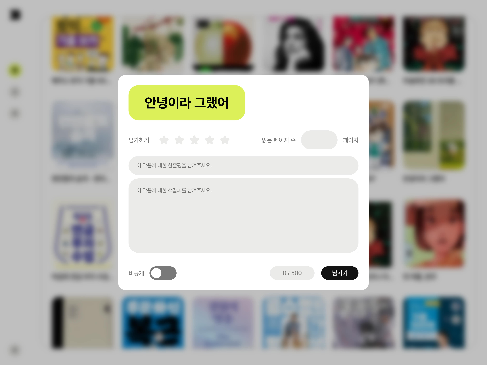

   **핵심 기능**
   - 알라딘 API를 통한 도서 목록 받아오기
   - isbn13 고유 번호를 이용, 책 디테일 GET/리뷰 POST
   - input 이벤트를 이용한 검색 기능
   - 평점, 읽은 페이지 수, 공개 여부(공개 시 커뮤니티 업로드) 설정, 리뷰 텍스트 카운트 기능
     **사용 컴포넌트**
   - Sidebar
   - Input
   - BookItem(-BookCover)
   - Modal(-Button, BookCover, Title, Input)
   - ScrollTopButton

4. **개인 서랍**

   로그인 후 접근 가능한 페이지입니다.

   로그인한 유저가 남긴 독서기록들을 한 번에 볼 수 있습니다.

   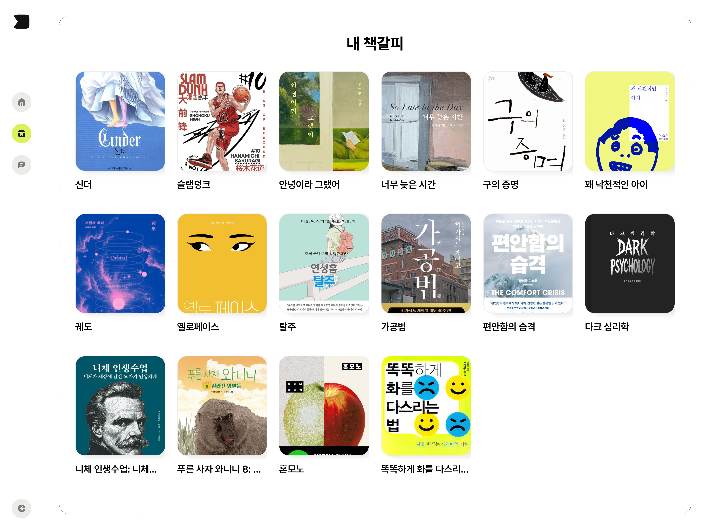
   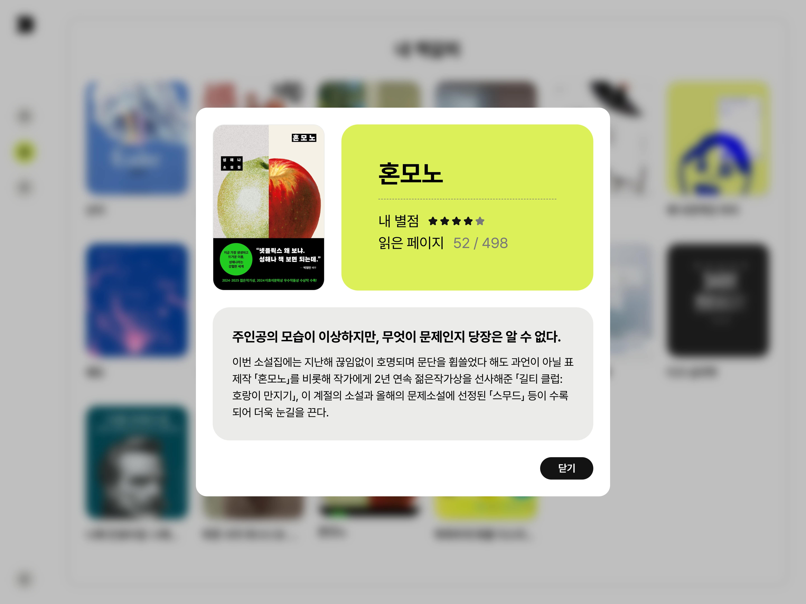

   **핵심 기능**
   - 개인이 남긴 전체 기록 조회
   - POST요청 때 저장한 isbn13을 토대로 기록을 남긴 도서 불러오기
     **사용 컴포넌트**
   - Sidebar
   - BookItem(-BookCover)
   - Modal(-Title, BookCover, Button)

5. **로그인/회원가입**

   로그인, 회원가입 진행 페이지입니다.

   로그인 시 서버에서 불러온 인증 토큰을 LocalStrorage 또는 SessionStorage에 담아 저장합니다.

   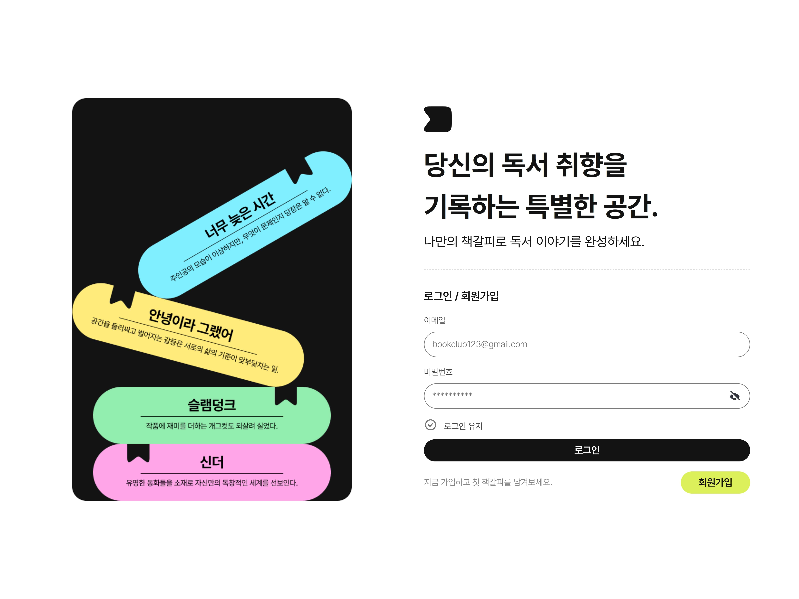
   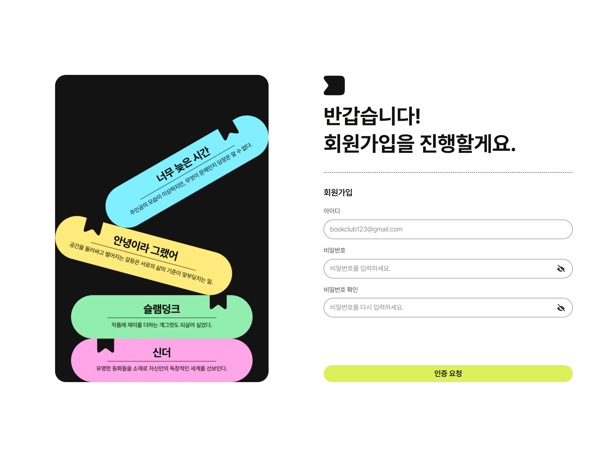

   **핵심 기능**
   - 로그인 유지 기능(on: 로컬스토리지에 토큰 저장 / off: 세션스토리지에 토큰 저장)
   - 비밀번호 미리보기 버튼
   - 메일로 인증 번호를 보내 실제 이메일 회원가입 유도
   - 이메일/비밀번호 정규표현식 검증
     **사용 컴포넌트** - Input - Button

6. 페이지별 반응형 대응

   중단점
   - `~576px` : 모바일 화면 대응
   - `~768px` : 태블릿 화면 대응
   - `~1240px` : 일반 PC 화면 대응(개인서랍, 커뮤니티)

   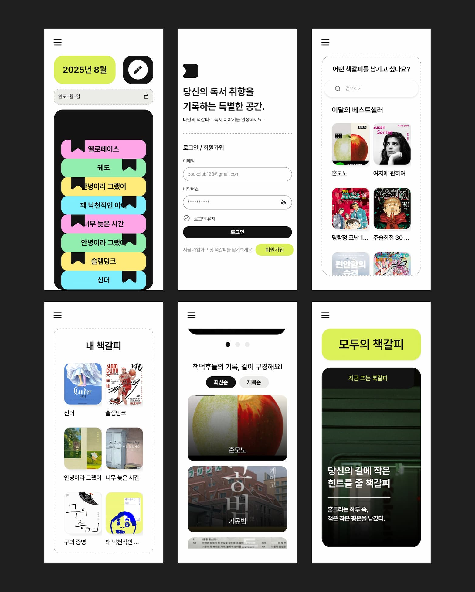

## 🎨 디자인

### 와이어프레임 설계

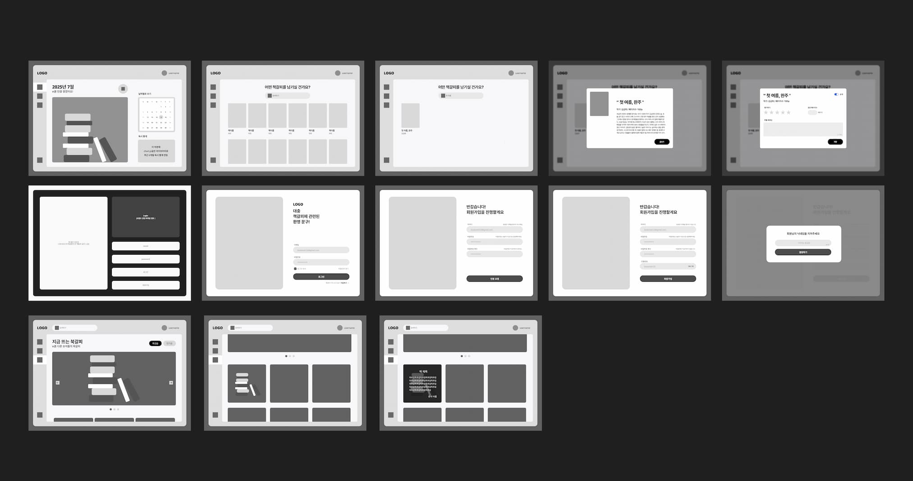

### 디자인 시스템

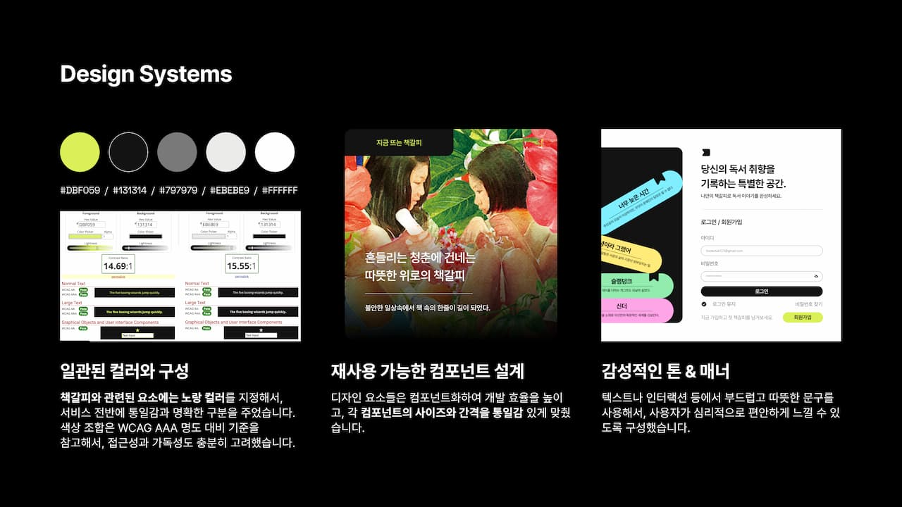

## 📌 참고 자료

- 캘린더 라이브러리 - vanilla calendar pro

  https://github.com/uvarov-frontend/vanilla-calendar-pro

- 알라딘 Open API 매뉴얼

  https://docs.google.com/document/d/1mX-WxuoGs8Hy-QalhHcvuV17n50uGI2Sg_GHofgiePE/edit?tab=t.0

- 디자인/아이디어 레퍼런스 - 북적북적

  https://www.studiobustles.com/

- 자바스크립트 코드 스타일 가이드 - 네이버

  https://github.com/naver/eslint-config-naver/blob/master/STYLE_GUIDE.md
